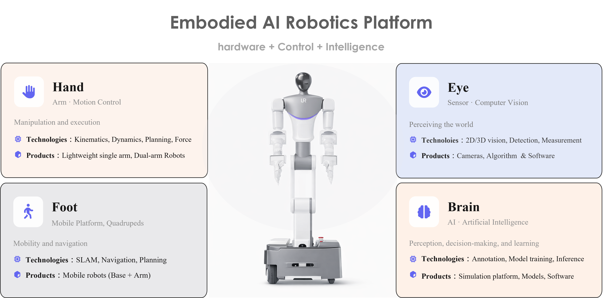

Based at the [Hong Kong Centre for Logistics Robotics (HKCLR)](https://www.hkclr.hk/), our team develops next-generation robotic systems that integrate **hardware, control, and artificial intelligence**. Our goal is to bridge the gap between **robotics research and real-world deployment**, enabling robust manipulation and autonomous interaction in complex environments.

Our embodied intelligence platform integrates **manipulation, perception, mobility, and AI**, enabling robots to operate in real-world environments.

---



We develop advanced robotic platforms for embodied intelligence.

Our core product line includes:

• Lightweight robotic arms  
• Mobile dual-arm manipulation platforms  
• Humanoid robots  
• Unified robot control systems  







---



Our technology stack integrates **perception, control, and AI** to enable robust robotic manipulation.

Core technologies include:

• Visual perception and 3D vision  
• Robot kinematics and force control  
• Motion planning and navigation  
• Vision-language-action models  







---



Our research investigates how robots achieve reliable manipulation in **unstructured and contact-rich environments**.

By integrating robotics, perception, and machine learning, we aim to develop systems capable of adaptive interaction and intelligent decision-making.







---



Our team brings together experts in robotics, artificial intelligence, and control systems.

Through interdisciplinary collaboration, we translate cutting-edge research into real-world robotic products.





